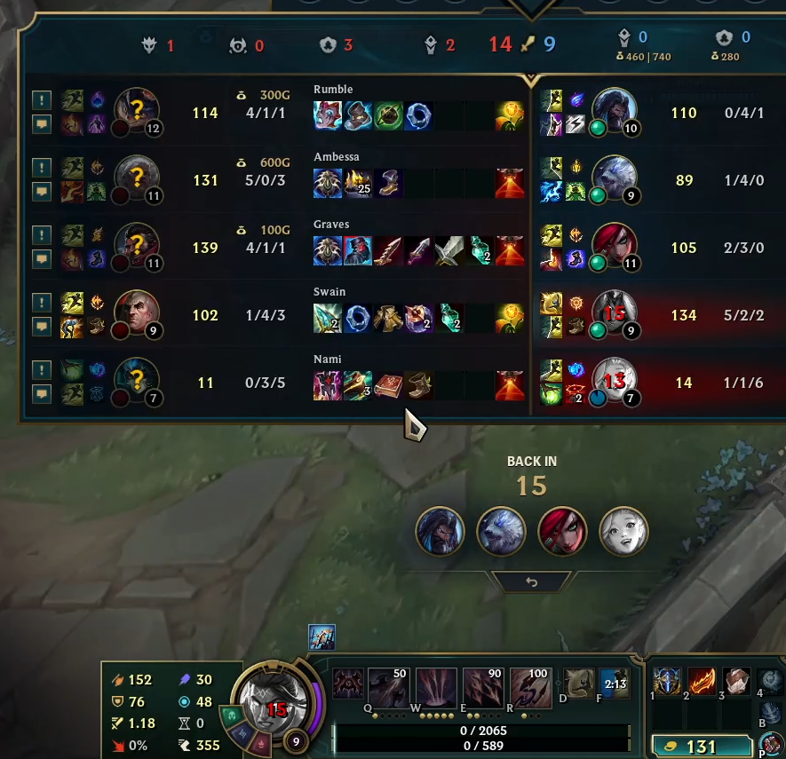
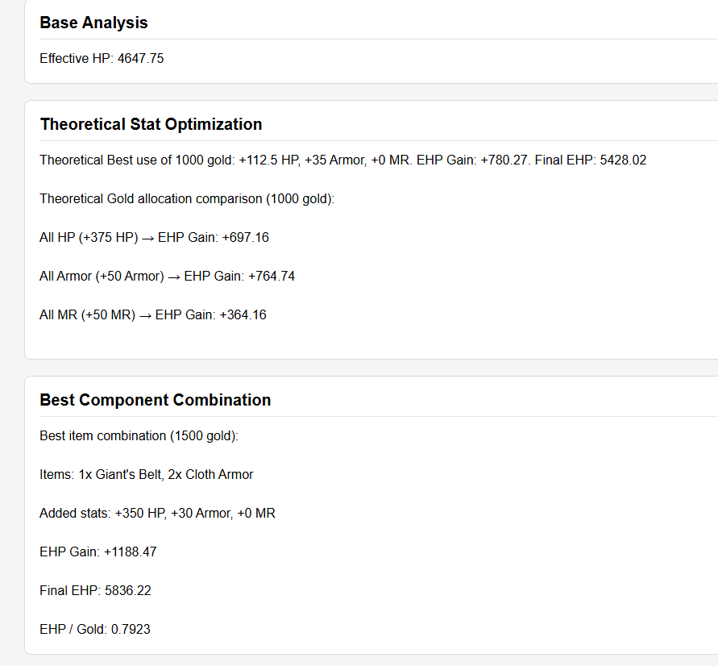
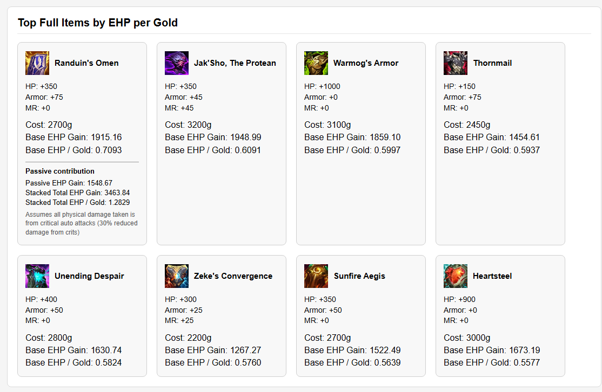

# LoL Effective HP Calculator

This is a simple web tool that analyzes **tank durability in League of Legends** by calculating Effective Health (EHP) against mixed physical and magic damage.

## Context

For readers unfamiliar with *League of Legends*: the player controls a character called a **champion**. Each champion has several statistics, including **Health Points (HP)**, which represent how much damage the champion can take before being defeated, as well as **Armor** and **Magic Resist (MR)**, which reduce incoming physical and magic damage.

During the game, players earn gold and can purchase items that increase these statistics, improving their champion’s survivability.

This tool analyzes how HP, Armor, and Magic Resist interact to determine **Effective Health (EHP)** — the total amount of damage a champion can take before its HP reaches zero after accounting for damage reduction from resistances.

The calculator helps players understand which **stats, components, or full items provide the most survivability** for a given situation.

The tool is fully client-side and written in **HTML, CSS, and JavaScript**.

---

# What the Calculator Does

The tool takes the following inputs:

* Current **HP**
* Current **Armor**
* Current **Magic Resist**
* **Enemy physical damage percentage**
* Available **gold**

From these values it evaluates several durability scenarios.

---

# Features

## Base Effective Health

Calculates your **current Effective HP** against the specified damage distribution.

This uses the standard LoL mitigation formulas:

Physical damage multiplier
`1 / (1 + Armor / 100)`

Magic damage multiplier
`1 / (1 + MR / 100)`

The calculator combines both using the enemy damage split.

---

## Theoretical Stat Optimization

The tool determines the **optimal distribution of raw stats** (HP, Armor, MR) for a fixed gold budget.

This shows the **theoretically best durability gain** if you could buy stats directly.

It also compares:

* All HP
* All Armor
* All MR
* Optimal stat mix

---

## Item Component Optimization

Given a gold budget, the tool tries **every possible combination of components** and finds the set that maximizes EHP.

Example output:

```
3x Ruby Crystal
1x Negatron Cloak
1x Giant's Belt
```

This shows the **best purchasable stat combination** rather than theoretical stats.

---

## Full Item Ranking

Completed tank items are evaluated separately and ranked by:

**EHP Gain**
Increase in effective health after buying the item.

**EHP Gain per Gold**
How efficient the item is at increasing survivability.

The tool displays the **top 8 most efficient items** for the current situation.

Note: Only **raw stats are considered**. Item passives are not included.

---

# Why This Tool Exists

Tank itemization in League of Legends is often unclear because:

* HP, Armor, and MR interact multiplicatively
* Different damage mixes favor different stats
* Items arent equally gold efficient

This calculator helps visualize **pure durability efficiency** and compare different item choices.

---

# Current Limitations

* Some Item **passives are not modeled**
* Inventory slot limits are not enforced
* Multiple copies of the same item may appear in component optimization
* Damage types are simplified to **physical vs magic**

# Running the Tool

Open `index.html` in your browser, or use the GitHub Pages version:

```
https://metroarcher.github.io/lol-ehp-calculator/
```

No installation or dependencies are required.

---
# Example of how I use this tool

This section is for those familiar with the game and have a sense of intuition of the game.
Lets look at this scenario of a game where i am playing varus, and i have already the first 2 core items that give me the necessary tools to output reasonable damage over time. 



Now looking at my next 3rd item, im looking for an item that gives me the maximum durability to survive the enemy engage so i can output my damage and also bait the enemies into using many abilities on me while my team can clean up the fight(for example Katarina loves having a bait like this). We also have an enchanter(Seraphine), so building defensively is even more effective as I increase the effective HP the shields/heals if i build resists (and also hp, as seraphine double W heals based on %missing hp).

So thinking this through, and also knowing that i have conditioning+overgrowth in runes (which makes both buying resists and hp more effective), i check if my intuition is correct(and effectively build my intuition from examples like these) and run the tool with the HP and armor i would have at the time of purchasing the  **FULL** item (this is important, because from when you start building the item until you finish the item, you get quite alot of hp and armor from levels that will make a big difference on what item will be best).

Based on game intuition, i predict that i will take around 70% physical damage from the enemy team, as swain is behind(and is more of a dps mage than burst) and rumble will hit me with his ult but usually wont reach me with his other spells. However ambessa is certainly going to be on top of me and graves will do the same aswell. I have put 1500 gold as the gold budget(its the usual gold i will recall on) but you can change it depending on what gold you have after a recall. So i put the information in the tool and i look at the analysis. 

First thing to look at is the theoretical stat optimization, to have a sense of what will currently give me the maximum durability.



From this i can understand that right now i want to put more gold into buying armor, so i should prioritize buying armor components of the item.



But when looking at the items i see that Randuins is the best gold effective item i can buy to be as tanky as possible against the enemy comp. And looking back at the component combination, if i want to be as tanky as possible and i have around 1500 gold, i should prioritize giants belt + 2x cloth armors as the buildpath for randuins, as the wardens mail passive isnt really useful against the enemy team composition. If we wanted to look at alternatives, for example jaksho could be better(the current tool doesnt calculate how effective it is with the passive on) but i know that in this game most fights will be bursty(they will damage me quickly in the beginning of the fight, i wont be able to stack jaksho until it is too late) so jaksho shouldnt be a good item here. Another option is warmogs which could be good (its passive is also not modeled in this tool), as it will give me more effective HP vs their team's magic damage dealers, however i see that in this game they have strong %HP damage (rumble Q, ambessa Q, nami's imperial mandate) so i also discard that option. As for the rest it should be pretty self explanatory that they are just worse overall.

There are other scenarios this tool can be used for, for tanks on toplane or as final items for other adcs (for example crit ADCS that have all their core items and just want to have the highest durability item late game). Just be mindful of a few item passives not being modeled, which should be clear from the UI of the tool if it is present or not.